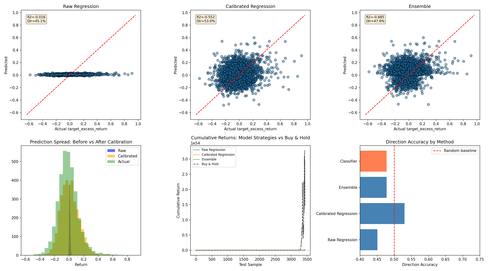
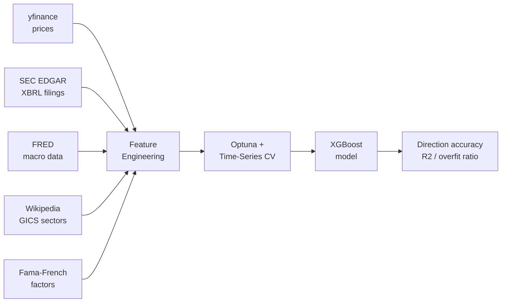

# Stock Return Prediction with XGBoost

[](https://github.com/Thomas-J-Barreras-Consulting/stock-prediction-ml/actions/workflows/ci.yml)
[](https://codecov.io/gh/Thomas-J-Barreras-Consulting/stock-prediction-ml)
[](https://www.python.org/downloads/)
[](LICENSE)

Predicting quarterly S&P 500 stock returns using financial fundamentals, technical indicators, and macroeconomic data.



## Overview

This project builds an XGBoost regression model to predict next-quarter excess stock returns (vs S&P 500 benchmark) based on features derived from real SEC EDGAR filings, technical price indicators, FRED macroeconomic data, and sector-relative metrics. The model is trained on ~436 S&P 500 companies using quarterly data from 2005-2026, with a temporal train/test split to prevent data leakage. Hyperparameters are tuned via Optuna Bayesian optimization with expanding-window time-series cross-validation.

## Pipeline



## Results

| Metric | Value |
|--------|-------|
| Direction Accuracy | 54.7% (calibrated) |
| Overfit Ratio | 0.87 |
| Test R2 | -0.018 |
| Features | 15 (after automated selection) |
| Trees | 145 (early stopping) |
| Dataset | ~10,700 samples, ~436 companies |


## Features

The model uses features across 9 categories, automatically selected from candidates via correlation filtering:

**Profitability** - revenue, revenue_growth, profit_margin, operating_margin, net_income, net_income_growth, operating_income_growth

**Per-Share** - eps_diluted, eps_growth

**Expense Ratios** - rd_ratio, sga_ratio, tax_rate

**Balance Sheet** - total_assets, debt_to_assets, debt_to_equity, current_ratio, cash_ratio, equity_ratio

**Returns & Efficiency** - roa, roe, asset_turnover, interest_coverage

**Cash Flow & Valuation** - operating_cash_flow, free_cash_flow, fcf_margin, market_cap, pe_ratio, price_to_book, quarter_price

**Technical Indicators** - ma_50_ratio, ma_200_ratio, momentum_3m, volatility, rsi_14, macd_histogram, bollinger_width, volume_trend, price_to_52wk_high

**Macro** - gs10 (10yr Treasury), vix, unemployment, gdp, cpi

**Sector-Relative & Interactions** - sector z-scores, sector differences, momentum x quality, risk x leverage, growth x profitability

## Project Structure

```
stock-prediction-ml/
├── scripts/                             # Data collection (run these first)
│   ├── download_prices.py               # S&P 500 price data via yfinance
│   ├── download_spy.py                  # SPY benchmark prices via yfinance
│   ├── download_sectors.py              # Sector classifications from Wikipedia
│   ├── download_macro.py                # FRED macroeconomic indicators
│   ├── download_ff_factors.py           # Fama-French 5 factors + momentum
│   └── extract_financials.py            # Parse SEC EDGAR quarterly filings
├── notebooks/
│   ├── 01_data_collection.ipynb         # Run all data collection scripts
│   ├── 02_feature_engineering.ipynb      # Transform raw data into ML features
│   ├── 03_model_training.ipynb          # Train XGBoost model (Google Colab)
│   └── 04_analysis.ipynb               # Evaluate results and visualizations
├── data/
│   ├── raw/kaggle/sec_edgar/            # SEC EDGAR XBRL filings
│   └── processed_dataset.csv           # Final ML-ready dataset
├── src/
│   ├── __init__.py
│   └── features.py                      # Importable feature engineering functions
├── tests/
│   ├── conftest.py                      # Shared pytest fixtures (synthetic data)
│   ├── test_data_validation.py          # Data format and range validation
│   ├── test_feature_engineering.py      # Feature function unit tests
│   └── test_model_validation.py         # Model output structure tests
├── models/
│   └── model_results.pkl                # Trained model, metrics, and predictions
├── results/                             # Generated charts and visualizations
├── .github/workflows/ci.yml             # GitHub Actions CI pipeline
├── requirements.txt
└── requirements-dev.txt                 # Test dependencies (pytest, flake8)
```

## Data Sources

- **Stock Prices**: [Yahoo Finance](https://finance.yahoo.com/) via yfinance - Daily OHLCV for ~500 S&P 500 companies (2005-present)
- **Financial Statements**: [SEC EDGAR](https://www.sec.gov/Archives/edgar/daily-index/xbrl/companyfacts.zip) - Real quarterly filings (10-Q) parsed from XBRL
- **Benchmark Prices**: [Yahoo Finance](https://finance.yahoo.com/) via yfinance - S&P 500 (SPY) daily prices for excess return calculation
- **Macroeconomic Data**: [FRED](https://fred.stlouisfed.org/) - 10yr Treasury, VIX, unemployment, GDP, CPI
- **Fama-French Factors**: [Kenneth French Data Library](https://mba.tuck.dartmouth.edu/pages/faculty/ken.french/data_library.html) - FF5 factors (SMB, HML, RMW, CMA) plus momentum (MOM)
- **Sector Classifications**: [Wikipedia](https://en.wikipedia.org/wiki/List_of_S%26P_500_companies) - GICS sector and sub-industry

## Methodology

1. **Data Collection** - Scripts download daily stock prices via yfinance, parse quarterly financial statements from SEC EDGAR XBRL data, fetch macroeconomic indicators from FRED, and scrape sector classifications from Wikipedia.

2. **Feature Engineering** - Computed features including profitability ratios, growth metrics, leverage ratios, efficiency metrics, valuation multiples, technical indicators (RSI, MACD, Bollinger Bands, momentum, volatility), macroeconomic context, sector-relative z-scores, and feature interactions. Target is excess return (stock return minus S&P 500 return).

   

3. **Feature Selection** - Automated pipeline removes zero-variance features, highly correlated features (>0.95 threshold), and features with weak target correlation (<0.03 threshold).

   

4. **Model Training** - Temporal train/test split ensures the model is only evaluated on future data. Expanding-window time-series cross-validation with 5 folds. Hyperparameter tuning via Optuna Bayesian optimization (150 trials) with early stopping. Huber loss objective for robustness to outliers.

5. **Analysis** - Evaluated using RMSE, R2, MAE, overfit ratio, Spearman rank correlation, and directional accuracy. Includes Optuna-tuned binary classifier for direction prediction.

## Reproducing Results

End-to-end runbook from a clean checkout.

### Prerequisites

- **Python 3.12+**
- **FRED API key** — free at [fred.stlouisfed.org](https://fred.stlouisfed.org/). Save as `FRED_API_KEY=...` in a `.env` file at the project root.
- **SEC EDGAR bulk data** — download [companyfacts.zip](https://www.sec.gov/Archives/edgar/daily-index/xbrl/companyfacts.zip) and extract into `data/raw/kaggle/sec_edgar/`.
- **Google Colab account** with GPU runtime (for notebook 03 only).

> **Note**: `data/` and `models/` artifacts are not checked into git. Each step below must be re-run per machine.

### 1. Environment setup (~2 min)

```bash
git clone https://github.com/Thomas-J-Barreras-Consulting/stock-prediction-ml.git
cd stock-prediction-ml

python -m venv venv
venv\Scripts\activate            # Windows
# source venv/bin/activate       # macOS/Linux

pip install -r requirements.txt -r requirements-dev.txt
```

### 2. Data collection (~10–15 min)

Run [notebook 01](notebooks/01_data_collection.ipynb) top-to-bottom, or invoke the scripts individually:

```bash
python scripts/download_prices.py       # S&P 500 daily OHLCV    -> data/price_data.pkl
python scripts/download_spy.py          # SPY benchmark prices   -> data/spy_data.pkl
python scripts/download_sectors.py      # GICS sectors           -> data/sector_data.pkl
python scripts/download_macro.py        # FRED indicators        -> data/macro_data.pkl
python scripts/download_ff_factors.py   # Fama-French factors    -> data/ff_factors.pkl
python scripts/extract_financials.py    # SEC EDGAR XBRL filings -> data/financial_data.pkl
```

### 3. Feature engineering (~3 min, local)

Run [notebook 02](notebooks/02_feature_engineering.ipynb) top-to-bottom. Produces `data/processed_dataset.csv` (~10,700 quarterly samples × ~50 features).

### 4. Model training (~30–60 min, Google Colab with GPU)

Upload [notebook 03](notebooks/03_model_training.ipynb) to Google Colab, switch the runtime to GPU, and run all cells. Saves `models/model_results.pkl` containing the trained XGBoost model, predictions, and metrics.

### 5. Analysis (~2 min, local)

Run [notebook 04](notebooks/04_analysis.ipynb) to regenerate the charts in [results/](results/) and evaluate direction accuracy, R², overfit ratio, and feature importances.

## Limitations

- Negative test R2 indicates the model doesn't generalize well on unseen future periods — this is typical for stock prediction
- No sentiment or alternative data sources
- Single model architecture (XGBoost only)
- Quarterly prediction horizon limits sample count per company

## Potential Improvements

- Experiment with LSTM or transformer models for time series
- Add sentiment analysis from earnings calls or news
- Ensemble methods combining multiple model architectures
- Shorter prediction horizons (monthly) for more training samples

## Engineering & MLOps

The repo treats research code as production code. Every push runs a multi-job [GitHub Actions pipeline](.github/workflows/ci.yml):

| Job | Tools | Purpose |
|---|---|---|
| **Lint & Type Check** | black, isort, flake8, mypy | Enforce formatting (line length 120), import order, style, and static types |
| **Security Audit** | pip-audit | Scan dependencies for known CVEs (`--strict`) |
| **Tests & Coverage** | pytest, codecov | 110 unit tests on synthetic data, coverage uploaded to Codecov |
| **Docker Build** | docker | Verify the [Dockerfile](Dockerfile) builds cleanly on every commit |

Run the full local check before pushing:

```bash
pip install -r requirements-dev.txt
black --check --line-length 120 src/ tests/ scripts/
isort --check-only --profile black --line-length 120 src/ tests/ scripts/
flake8 src/ tests/ --max-line-length 120 --ignore E501,W503
mypy src/ --ignore-missing-imports
pytest tests/ -v --cov=src
```

All 110 tests use synthetic data fixtures (see [tests/conftest.py](tests/conftest.py)) and run without any real data files — CI stays fast and deterministic.

## Tech Stack

- **Language**: Python 3.12+
- **ML**: XGBoost, Optuna, scikit-learn, scipy
- **Data**: pandas, NumPy, yfinance, fredapi
- **Visualization**: matplotlib, seaborn
- **Quality**: pytest, black, isort, flake8, mypy, pip-audit
- **Infra**: GitHub Actions (CI), Docker, Google Colab (GPU training), Codecov
